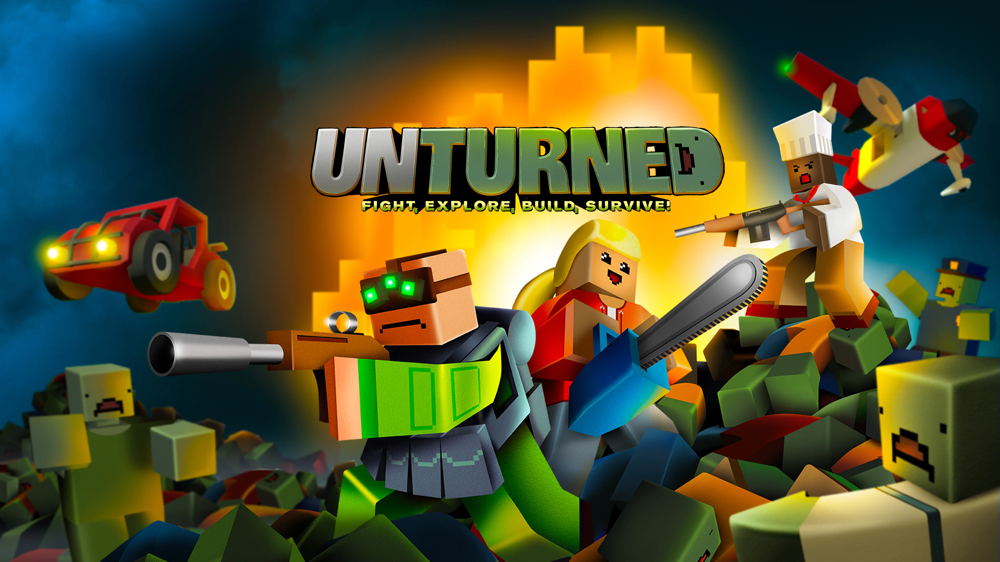

# 2023.2_Unturned

 

# Sobre

Esse repositório é dedicado a realização dos trabalhos da matéria Sistemas de Banco de Dados 1. O jogo base escolhido para a realização dos trabalhos é o Unturned, que desrespeito a um jogo de mundo aberto de sobrevivência com a temática de apocalipse zumbi. 

## Apresentações

[Apresentação do Módulo 1]()  

## Entregas

- Módulo 1
  - [DER](docs/DER.md)
  - [MR](docs/MR.md)

## Integrantes do grupo

|**Foto**| **Matrícula** |            **Nome**             |
|:-------:| :-----------: | :-----------------------------: |
|  |   200057421   |      Delziron Braz de Lima      |
||   200017519   |  Eurico Menezes de Abreu Neto   |
| |   200067923   | João Henrique Marques Calzavara |
|  |   200062379   |     Marcos Vinícius de Deus     | 

