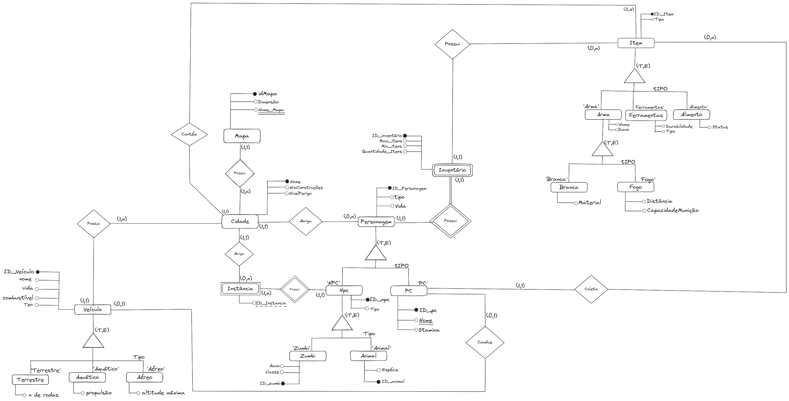

# DER - Diagrama Entidade Relacionamento

&emsp;&emsp; O Diagrama de Entidade-Relacionamento (DER), também conhecido como Diagrama ER, é uma ferramenta utilizada na modelagem de dados em bancos de dados relacionais. Ele fornece uma representação gráfica das entidades, atributos e relacionamentos entre os dados de um sistema.

&emsp;&emsp; O DER é composto por três elementos principais: entidades, atributos e relacionamentos.

&emsp;&emsp; Entidades representam os objetos do mundo real que serão armazenados no banco de dados. Por exemplo, em um sistema de gerenciamento de biblioteca, as entidades podem ser "livro", "autor" e "usuário".

&emsp;&emsp; Atributos são as características ou propriedades das entidades. Por exemplo, para a entidade "livro", os atributos podem ser "título", "autor" e "ano de publicação".

&emsp;&emsp; Relacionamentos são as associações entre entidades. Por exemplo, um livro pode ter um relacionamento com um autor, indicando que um autor pode ter escrito vários livros.

&emsp;&emsp; O DER é desenhado usando símbolos específicos. Uma caixa retangular representa uma entidade, com os atributos listados dentro dela. Os relacionamentos são representados por linhas que conectam as entidades, com uma indicação da cardinalidade do relacionamento, ou seja, quantos objetos de uma entidade estão associados a quantos objetos de outra entidade.

<figcaption align='center'>
    <b>Figura 1: Diagrama Entidade Relacionamento</b>
     <small>Fonte: Elaboração Própria</small>
</figcaption> 

 
