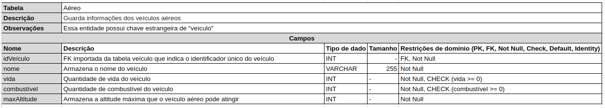

# Dicionário de Dados

Um dicionário de dados em um sistema de banco de dados é um repositório central de informações sobre a estrutura e propriedades dos dados armazenados. Ele inclui detalhes como nomes, tipos de dados, restrições, relacionamentos, índices e permissões associadas a tabelas e colunas. Essas informações são cruciais para o gerenciamento eficaz do banco de dados, permitindo aos administradores e usuários entenderem e manipularem os dados de maneira adequada. O dicionário de dados facilita a organização, manutenção, desenvolvimento e consulta do banco de dados, sendo essencial para uma gestão eficiente e uso otimizado das informações contidas no sistema.[1]

&emsp;&emsp; Para o contexto do nosso projeto, buscamos fazer o dicionário de dados do jogo Unturned, para o projeto de Banco de Dados no primeiro módulo da disciplina.

### Entidade Mapa

<figcaption align='center'>
    <b>Figura 1: Mapa </b>
     <small>Fonte: Elaboração Própria</small>
</figcaption> 

### Entidade Cidade

<figcaption align='center'>
    <b>Figura 2: Cidade </b>
     <small>Fonte: Elaboração Própria</small>
</figcaption> 

### Entidade Veículo

<figcaption align='center'>
    <b>Figura 3: Veículo </b>
     <small>Fonte: Elaboração Própria</small>
</figcaption> 

### Entidade Terrestre

<figcaption align='center'>
    <b>Figura 4: Terrestre </b>
     <small>Fonte: Elaboração Própria</small>
</figcaption> 

### Entidade Aquático

<figcaption align='center'>
    <b>Figura 5: Aquático </b>
     <small>Fonte: Elaboração Própria</small>
</figcaption> 

### Entidade Aéreo

<figcaption align='center'>
    <b>Figura 6: Aéreo </b>
     <small>Fonte: Elaboração Própria</small>
</figcaption> 

## Fontes
- [1](https://medium.com/psicodata/dicionario-de-dados-ac3ce726c34b) 

