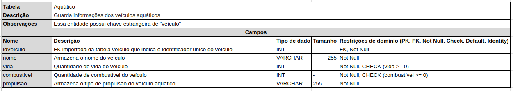
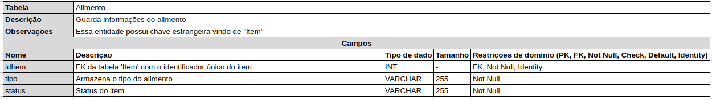

# Dicionário de Dados

&emsp;&emsp; Um dicionário de dados em um sistema de banco de dados é um repositório central de informações sobre a estrutura e propriedades dos dados armazenados. Ele inclui detalhes como nomes, tipos de dados, restrições, relacionamentos, índices e permissões associadas a tabelas e colunas. Essas informações são cruciais para o gerenciamento eficaz do banco de dados, permitindo aos administradores e usuários entenderem e manipularem os dados de maneira adequada. O dicionário de dados facilita a organização, manutenção, desenvolvimento e consulta do banco de dados, sendo essencial para uma gestão eficiente e uso otimizado das informações contidas no sistema.[1]

&emsp;&emsp; Para o contexto do nosso projeto, buscamos fazer o dicionário de dados do jogo Unturned, para o projeto de Banco de Dados no primeiro módulo da disciplina.

### Entidade Mapa

<figcaption align='center'>
    <b>Figura 1: Mapa </b>
     <small>Fonte: Elaboração Própria</small>
</figcaption> 

### Entidade Cidade

<figcaption align='center'>
    <b>Figura 2: Cidade </b>
     <small>Fonte: Elaboração Própria</small>
</figcaption> 

### Entidade Veículo

<figcaption align='center'>
    <b>Figura 3: Veículo </b>
     <small>Fonte: Elaboração Própria</small>
</figcaption> 

### Entidade Terrestre

<figcaption align='center'>
    <b>Figura 4: Terrestre </b>
     <small>Fonte: Elaboração Própria</small>
</figcaption> 

### Entidade Aquático

<figcaption align='center'>
    <b>Figura 5: Aquático </b>
     <small>Fonte: Elaboração Própria</small>
</figcaption> 

### Entidade Aéreo

<figcaption align='center'>
    <b>Figura 6: Aéreo </b>
     <small>Fonte: Elaboração Própria</small>
</figcaption> 

### Entidade Personagem

<figcaption align='center'>
    <b>Figura 7: Personagem </b>
     <small>Fonte: Elaboração Própria</small>
</figcaption> 

### Entidade NPC

<figcaption align='center'>
    <b>Figura 8: NPC </b>
     <small>Fonte: Elaboração Própria</small>
</figcaption> 

### Entidade PC

<figcaption align='center'>
    <b>Figura 9: PC </b>
     <small>Fonte: Elaboração Própria</small>
</figcaption> 

### Entidade Instancia

<figcaption align='center'>
    <b>Figura 10: Instância </b>
     <small>Fonte: Elaboração Própria</small>
</figcaption> 

### Entidade Zumbi

<figcaption align='center'>
    <b>Figura 11: Zumbi </b>
     <small>Fonte: Elaboração Própria</small>
</figcaption> 

### Entidade Animal

<figcaption align='center'>
    <b>Figura 12: Animal </b>
     <small>Fonte: Elaboração Própria</small>
</figcaption> 

### Entidade Inventario

<figcaption align='center'>
    <b>Figura 13: Inventario </b>
     <small>Fonte: Elaboração Própria</small>
</figcaption> 

### Entidade Item

<figcaption align='center'>
    <b>Figura 14: Item </b>
     <small>Fonte: Elaboração Própria</small>
</figcaption> 

### Entidade Ferramenta

<figcaption align='center'>
    <b>Figura 15: Ferramenta </b>
     <small>Fonte: Elaboração Própria</small>
</figcaption> 

### Entidade Alimento

<figcaption align='center'>
    <b>Figura 16: Alimento </b>
     <small>Fonte: Elaboração Própria</small>
</figcaption> 

### Entidade Arma

<figcaption align='center'>
    <b>Figura 17: Arma </b>
     <small>Fonte: Elaboração Própria</small>
</figcaption> 

### Entidade Fogo

<figcaption align='center'>
    <b>Figura 18: Fogo </b>
     <small>Fonte: Elaboração Própria</small>
</figcaption> 

### Entidade Branca

<figcaption align='center'>
    <b>Figura 19: Branca </b>
     <small>Fonte: Elaboração Própria</small>
</figcaption> 

## Fontes
- COSTA, Dalton. [Um guia de como criar um dicionário de dados para a sua pesquisa](https://medium.com/psicodata/dicionario-de-dados-ac3ce726c34b). 29 de Outubro 2021

