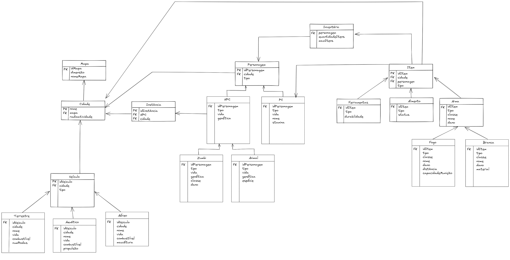
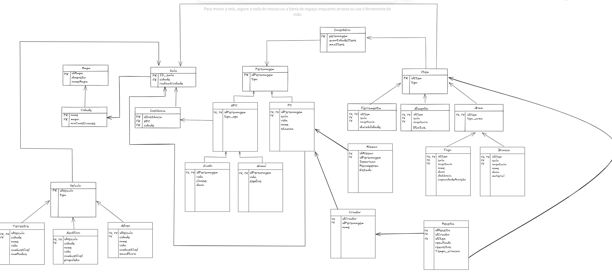

# MR - Modelo Relacionamento

&emsp;&emsp; Um Modelo de Relacionamento é uma representação visual de como as entidades (ou tabelas) em um banco de dados estão relacionadas entre si. É uma parte fundamental da fase de projeto de banco de dados, onde os designers de bancos de dados criam uma estrutura lógica que define as entidades, seus atributos e os relacionamentos entre elas. Esses modelos ajudam a compreender como os dados estão organizados e como as informações estão interconectadas.

&emsp;&emsp; Agora, a seguir, apresentaremos um Modelo de Relacionamento (MR) específico relacionado ao jogo Unturned, que ilustrará como as diferentes partes do jogo estão interconectadas e como os dados são organizados no contexto que iremos desenvolver desse jogo.

## Versão 1 desatualizada

<figcaption align='center'>
    <b>Figura 2: Modelo Relacional Versão 1 </b>
     <small>Fonte: Elaboração Própria</small>
</figcaption> 

## Versão 2 atualizada

<figcaption align='center'>
    <b>Figura 2: Modelo Relacional Versão 2 </b>
     <small>Fonte: Elaboração Própria</small>
</figcaption> 

 
